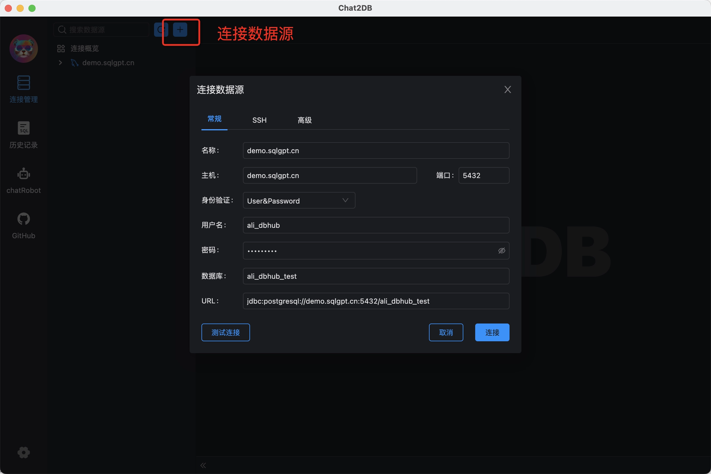
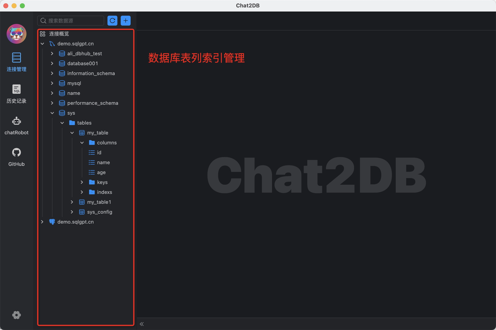
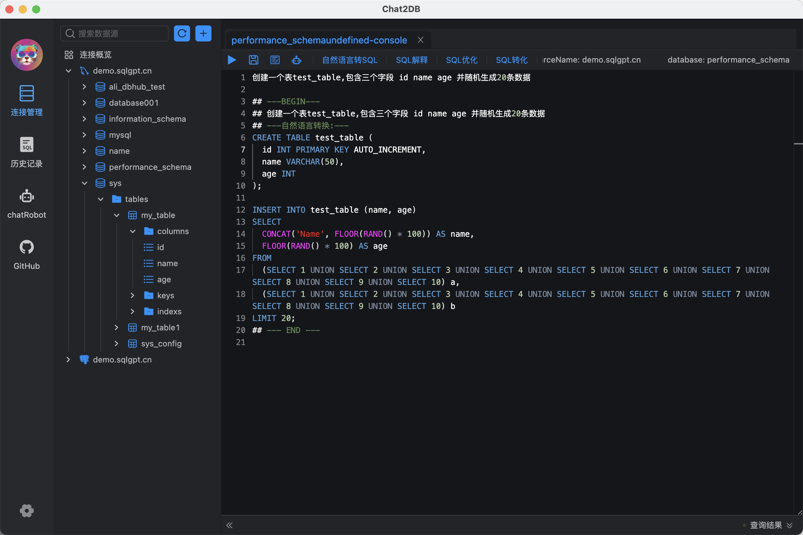

<h1 align="center">Chat2DB</h1>

<div align="center">

🔥🔥🔥 智能且多功能的SQL客户端和报表工具，适用于各种数据库

[](https://www.apache.org/licenses/LICENSE-2.0.html)
[](https://openjdk.java.net/)
[](https://github.com/alibaba/ali-dbhub/releases)
[](https://github.com/alibaba/ali-dbhub/stargazers)
[](https://github.com/alibaba/ali-dbhub/fork)
[](https://github.com/alibaba/ali-dbhub/graphs/contributors)

语言： 中文 | [English](README_CN.md)
</div>
<a href="https://star-history.com/#alibaba/chat2db&Date">
  <picture>
    <source media="(prefers-color-scheme: dark)" srcset="https://api.star-history.com/svg?repos=alibaba/chat2db&type=Date&theme=dark" />
    <source media="(prefers-color-scheme: light)" srcset="https://api.star-history.com/svg?repos=alibaba/chat2db&type=Date" />
    
  </picture>
</a>

## 📖 简介
&emsp; &emsp;Chat2DB 是一款有开源免费的多数据库客户端工具，支持windows、mac本地安装，也支持服务器端部署，web网页访问。和传统的数据库客户端软件Navicat、DBeaver 相比Chat2DB集成了AIGC的能力，能够将自然语言转换为SQL，也可以将SQL转换为自然语言，可以给出研发人员SQL的优化建议，极大的提升人员的效率，是AI时代数据库研发人员的利器，未来即使不懂SQL的运营业务也可以使用快速查询业务数据、生成报表能力。
## ✨ 特性
- 🌈 AI智能助手，支持自然语言转SQL、SQL转自然语言、SQL优化建议
- 👭 支持团队协作，研发无需知道线上数据库密码，解决企业数据库账号安全问题
- ⚙️ 强大的数据管理能力，支持数据表、视图、存储过程、函数、触发器、索引、序列、用户、角色、授权等管理
- 🔌 强大的扩展能力，目前已经支持MySQL、PostgreSQL、Oracle、SQLServer、ClickHouse、OceanBase、H2、SQLite等等，未来会支持更多的数据库
- 🛡 前端使用 Electron 开发，提供 Windows、Mac、Linux 客户端、网页版本一体化的解决方案
- 🎁 支持环境隔离、线上、日常数据权限分离

## ⏬ 下载安装
| 描述                   | 下载地址                                                                                                                                                                                                                                       |
|-----------------------|--------------------------------------------------------------------------------------------------------------------------------------------------------------------------------------------------------------------------------------------|
| Windows               | [https://oss-chat2db.alibaba.com/release/1.0.9/Chat2DB%20Setup%201.0.9.exe](https://oss-chat2db.alibaba.com/release/1.0.9/Chat2DB%20Setup%201.0.9.exe) |
| MacOS ARM64 (Apple芯片) | [https://oss-chat2db.alibaba.com/release/1.0.9/Chat2DB-1.0.9-arm64.dmg](https://oss-chat2db.alibaba.com/release/1.0.9/Chat2DB-1.0.9-arm64.dmg) |
| MacOS X64 (Intel芯片)   | [https://oss-chat2db.alibaba.com/release/1.0.9/Chat2DB-1.0.9.dmg](https://oss-chat2db.alibaba.com/release/1.0.9/Chat2DB-1.0.9.dmg) |       
| Jar包                  | [https://oss-chat2db.alibaba.com/release/1.0.9/ali-dbhub-server-start.jar](https://oss-chat2db.alibaba.com/release/1.0.9/ali-dbhub-server-start.jar) |                                                                                                                

## 🌰 使用Demo
### 创建数据源
<a></a>

### 数据源管理
<a></a>

### SQL控制台 及 AI智能助手
<a></a>


## 📦 Docker部署

```bash
  docker pull chat2db/chat2db:latest
  // 前台运行,运行后不能关闭命令行
  docker run -ti --name=chat2db -p 10824:10824 chat2db/chat2db:latest
  // 后台运行,运行后可以关闭命令行
  docker run --name=chat2db -p 10824:10824 chat2db/chat2db:latest
  // 这里正常会提示 Tomcat started on port(s): 10824 (http) with context path 就可以结束了
  
  // 如果这里提示  The container name "/chat2db" is already in use by container, 代表已经存在容器了 运行
  dcoker run chat2db
  // 如果想更新chat2db 则需要先rm 再运行
  dcoker rm chat2db
```
## 🎯 运行环境
注意：
如果需要本地调试
- java运行 <a href="https://adoptopenjdk.net/" target="_blank">Open JDK 17</a>
- Node运行环境Node16 <a href="https://nodejs.org/" target="_blank">Node.js</a>.
## 💻 本地调试
- git clone到本地
```bash
$ git clone git@github.com:alibaba/Chat2DB.git
```
- 前端安装
```bash
$ cd Chat2DB/ali-dbhub-client
$ npm install # 安装前端依赖
$ npm run build:prod # 把js打包生成到后端的source目录
```
- 后端调试
```bash
$ cd ../ali-dbhub-server
$ mvn clean install # 需要安装maven 3.8以上版本
$ cd ali-dbhub-server/ali-dbhub-server-start/target/
$ java -jar -Dchatgpt.apiKey=xxxxx ali-dbhub-server-start.jar  # 启动应用 chatgpt.apiKey 需要输入ChatGPT的key,如果不输入无法使用AIGC功能
$ # 打开 http://127.0.0.1:10821 开启调试 注：需要进行前端安装
```

- 前端调试
```bash
$ cd Chat2DB/ali-dbhub-client
$ npm install 
$ npm run start
$ # 打开 http://127.0.0.1:10821 开启前端调试
$ # 注：前端页面完全赖服务，所以前端同学调试也需要把后端项目跑起来
```
但是前端调试需要映射下资源，可以下载[XSwitch](https://chrome.google.com/webstore/detail/idkjhjggpffolpidfkikidcokdkdaogg),添加以下配置文件
``` json
{
  "proxy": [
    [
      "http://127.0.0.1:10821/(.*).js$",
      "http://127.0.0.1:8001/$1.js",
    ],
    [
      "http://127.0.0.1:10821/(.*).css$",
      "http://127.0.0.1:8001/$1.css",
    ],
    [
      "http://127.0.0.1:10821/static/front/(.*)",
      "http://127.0.0.1:8001/$1",
    ],
    [
      "http://127.0.0.1:10821/static/(.*)$",
      "http://127.0.0.1:8001/static/$1",
    ],
  ],
}
```


## 📑 文档

* <a href="https://github.com/alibaba/ali-dbhub/wiki">WIKI</a>
* <a href="https://github.com/alibaba/ali-dbhub/issues">Issue tracker</a>

## ☎️ 联系我们

如果觉得对你有帮助请点个star吧。

<a></a>
<a></a>


微信：yxccw132  钉钉：9135032392

## ❤️ 致谢
感谢所有为Chat2DB贡献力量的同学们~

<a href="https://github.com/alibaba/ali-dbhub/graphs/contributors">
  
</a>


